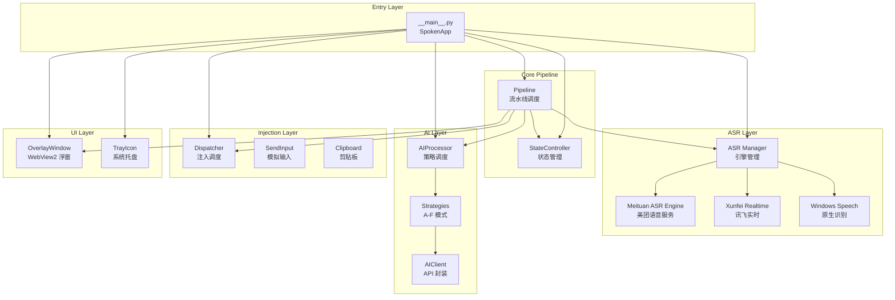

# Design Document: Spoken V3

## Overview

Spoken V3 是对现有架构的全面升级，重点关注稳定性、性能和功能扩展。设计基于现有的模块化架构（SpokenApp + Pipeline + StateController），在此基础上优化关键路径，增强可靠性，并集成新的 ASR 服务。

## Architecture

### High-Level Architecture



### Key Architectural Changes

1. **ASR Manager**: 引入统一的 ASR 引擎管理器，支持多引擎动态切换和故障转移
2. **Overlay Cropping Stability**: 增强浮窗裁切区域的计算和应用逻辑
3. **Performance Pipeline**: 优化流水线延迟，移除不必要的等待
4. **Mode Splitting**: 将 Mode E（结构化纪要）拆分为两个独立模式

## Components and Interfaces

### 1. ASR Manager (新增)

负责管理多个 ASR 引擎，提供统一的引擎选择、故障转移和长语音支持。

```python
class ASRManager:
    """ASR 引擎管理器。"""

    def __init__(self, config: dict) -> None:
        self._engines: dict[str, ASREngine] = {}
        self._priority: list[str] = []  # 引擎优先级顺序
        self._current_engine: Optional[ASREngine] = None
        self._long_audio_threshold: float = 60.0  # 长语音阈值（秒）

    def register(self, name: str, engine: ASREngine) -> None:
        """注册 ASR 引擎。"""
        ...

    def start(self) -> None:
        """启动当前引擎，失败时自动降级。"""
        ...

    def stop(self) -> str:
        """停止录音并返回结果。"""
        ...

    def get_engine_for_duration(self, estimated_duration: float) -> str:
        """根据预估时长选择合适的引擎。"""
        ...

    def fallback(self) -> bool:
        """故障转移到下一个可用引擎。"""
        ...
```

### 2. Meituan ASR Engine (新增)

美团内部语音识别服务的适配器实现。

```python
class MeituanASREngine(ASREngine):
    """美团语音识别引擎适配器。"""

    def __init__(self, config: dict) -> None:
        self._api_endpoint = config.get("endpoint")
        self._app_key = config.get("app_key")
        self._app_secret = config.get("app_secret")
        self._ws: Optional[WebSocket] = None
        self._max_duration: int = 600  # 最大支持 10 分钟

    def load(self) -> bool:
        """初始化引擎，验证凭证。"""
        ...

    def start(self) -> None:
        """开始实时识别。"""
        ...

    def stop(self) -> str:
        """停止识别并返回结果。"""
        ...

    def _authenticate(self) -> str:
        """获取认证 token。"""
        ...

    def _reconnect(self) -> bool:
        """断线重连。"""
        ...
```

### 3. Overlay Window (增强)

增强浮窗的裁切稳定性。

```python
class OverlayWindow:
    """WebView2 浮窗（V3 增强）。"""

    # 新增：裁切区域缓存
    _cached_region: Optional[int] = None
    _region_width: int = 0
    _region_height: int = 0

    def _apply_rounded_region(self, width: int, height: int) -> None:
        """应用圆角裁切区域（增强版）。

        改进点：
        1. 增加裁切区域有效性验证
        2. 防止频繁重设导致的闪烁
        3. DPI 缩放自适应
        """
        if not self._should_update_region(width, height):
            return  # 缓存命中，跳过更新

        # ... 原有逻辑 ...

        # 验证裁切结果
        if not self._verify_region_applied():
            logger.warning("裁切区域验证失败，尝试重新应用")
            self._retry_apply_region()

    def _should_update_region(self, width: int, height: int) -> bool:
        """判断是否需要更新裁切区域。"""
        # 尺寸未变化，且已有有效裁切，跳过
        if width == self._region_width and height == self._region_height:
            if self._cached_region and self._verify_region_applied():
                return False
        return True

    def _verify_region_applied(self) -> bool:
        """验证裁切区域是否正确应用。"""
        if not self._hwnd_cache:
            return False
        hrgn = gdi32.CreateRectRgn(0, 0, 0, 0)
        result = user32.GetWindowRgn(self._hwnd_cache, hrgn)
        return result > 1  # SIMPLEREGION 或 COMPLEXREGION
```

### 4. Pipeline (优化)

优化流水线性能，移除不必要的延迟。

```python
class Pipeline:
    """处理流水线（V3 性能优化）。"""

    # 性能优化点：
    # 1. 移除所有固定 sleep 延迟
    # 2. 使用事件驱动替代轮询
    # 3. 优化 ASR 停止后的等待逻辑

    def run_realtime(self) -> None:
        """流式识别流水线（优化版）。"""
        try:
            self._notify_state("recognizing")
            self._overlay_set_state("recognizing")

            # 优化：直接等待最终结果，不添加额外延迟
            raw_text = self._asr_engine.stop()

            if raw_text:
                # 立即开始 AI 处理
                self._run_ai_and_inject(raw_text)
            else:
                self._handle_empty_result()

        except Exception as e:
            self._handle_pipeline_error(e)
        finally:
            self.finish()
```

### 5. Mode Strategies (扩展)

扩展模式策略，支持会议纪要和内容结构化的分离。

```python
# 现有模式：
# A: 直接输出
# B: AI 润色
# C: Prompt 转换
# D: 翻译

# V3 新增模式：
# E: 会议纪要（原结构化纪要拆分）
# F: 内容结构化整理（原结构化纪要拆分）

class MeetingMinutesStrategy(OpenAIStrategy):
    """模式 E：会议纪要模式。"""

    def __init__(self, client, **kwargs):
        super().__init__(client, mode="E", **kwargs)
        # 专门的会议纪要提示词
        self._system_prompt = """你是一个专业的会议纪要助手。
请将会议录音转写的文本整理成结构化的会议纪要，包含：
1. 会议主题
2. 参与者（如能识别）
3. 主要讨论点
4. 决策事项
5. 待办事项

输出格式要求简洁、清晰，使用 Markdown 格式。"""


class ContentStructuringStrategy(OpenAIStrategy):
    """模式 F：内容结构化整理模式。"""

    def __init__(self, client, **kwargs):
        super().__init__(client, mode="F", **kwargs)
        # 通用内容结构化提示词
        self._system_prompt = """你是一个内容整理助手。
请将输入的文本整理成清晰的结构化内容，包括：
1. 核心主题识别
2. 要点提取和分类
3. 逻辑关系梳理
4. 关键信息高亮

保持原文核心含义，使内容更易读、易理解。"""
```

## Data Models

### ASR Configuration

```python
@dataclass
class ASRConfig:
    """ASR 配置模型。"""
    mode: str = "realtime"  # realtime / batch
    realtime_provider: str = "meituan"  # meituan / xunfei / windows
    fallback_order: list[str] = field(default_factory=lambda: ["meituan", "xunfei", "windows"])
    long_audio_threshold: float = 60.0  # 秒
    max_audio_duration: float = 600.0  # 最大 10 分钟
```

### Mode Configuration

```python
@dataclass
class ModeConfig:
    """模式配置模型。"""
    id: str  # A-F
    name: str  # 显示名称
    description: str  # 描述
    icon: str  # 托盘图标角标
    timeout_sec: float = 10.0
    custom_prompt: str = ""

# 默认模式配置
DEFAULT_MODES = {
    "A": ModeConfig("A", "直接输出", "直接输出识别文字", "", timeout_sec=0),
    "B": ModeConfig("B", "AI 润色", "AI 润色识别文字", "✨"),
    "C": ModeConfig("C", "Prompt", "转换为 Prompt 格式", "📝"),
    "D": ModeConfig("D", "翻译", "翻译为目标语言", "🌐"),
    "E": ModeConfig("E", "会议纪要", "整理为会议纪要", "📋"),
    "F": ModeConfig("F", "结构化", "内容结构化整理", "📊"),
}
```

### Overlay State

```python
@dataclass
class OverlayState:
    """浮窗状态模型。"""
    visible: bool = False
    state: str = "recording"  # recording / recognizing / ai_processing / injecting / notice
    text: str = ""
    mode: str = "A"
    duration: float = 0.0  # 录音时长（秒）
    region_valid: bool = True  # 裁切区域是否有效
```

## Correctness Properties

*属性是系统在所有有效执行中应保持的特征或行为——本质上是关于系统应该做什么的形式化陈述。属性作为人类可读规范与机器可验证正确性保证之间的桥梁。*

### Property-Based Testing Overview

基于属性的测试（PBT）通过在大量生成的输入上测试通用属性来验证软件正确性。每个属性都是一个应该在所有有效输入上成立的形式化规范。

### Core Principles

1. **全量量化**: 每个属性必须包含明确的 "for all" 语句
2. **需求追溯**: 每个属性必须引用其验证的需求
3. **可执行规范**: 属性必须可实现为自动化测试
4. **全面覆盖**: 属性应覆盖所有可测试的验收标准

### Acceptance Criteria Testing Prework

**Requirement 1: 架构稳定性增强**

1.1. THE Overlay SHALL 初始化时隐藏窗口直到 WebView2 内容完全加载
- Thoughts: 这是一个 UI 时序问题，涉及 WebView2 内容加载完成的检测。可以通过模拟初始化流程，检查窗口在 DOM ready 事件触发前的可见性状态来测试。
- Testable: yes - property

1.2. WHEN 浮窗显示或隐藏时，THE Overlay SHALL 平滑过渡而不出现闪烁
- Thoughts: "平滑过渡"和"不闪烁"是视觉体验问题，难以用自动化测试量化。但可以通过检查过渡逻辑的实现正确性（如渐隐渐显的时间参数、状态一致性）来间接验证。
- Testable: no - UI 视觉体验

1.3. WHEN 浮窗内容更新时，THE Overlay SHALL 正确计算并应用裁切区域，确保内容完整显示
- Thoughts: 可以生成不同的窗口尺寸和内容，验证裁切区域的计算是否正确覆盖了内容区域。关键属性：裁切区域边界应等于或大于内容渲染区域。
- Testable: yes - property

1.4. WHEN 窗口大小改变时，THE Overlay SHALL 重新计算裁切区域并保持稳定性
- Thoughts: 可以生成随机的窗口尺寸变化序列，验证每次变化后裁切区域都被正确更新，且不会出现无效状态。
- Testable: yes - property

1.5. WHEN 应用收到 Windows 电源管理事件时，THE System SHALL 正确处理而不崩溃
- Thoughts: 需要模拟 Windows 电源管理事件，验证应用能正确响应。这属于系统集成测试，可以通过注入模拟事件来测试。
- Testable: yes - example

1.6. WHEN 多线程操作发生竞态条件时，THE System SHALL 使用适当的同步机制避免死锁或崩溃
- Thoughts: 竞态条件测试需要并发执行多个操作，验证状态一致性。可以设计属性测试，并发执行状态变更操作，验证最终状态正确。
- Testable: yes - property

1.7. THE Overlay SHALL 在多显示器环境下正确显示在活动窗口附近
- Thoughts: 多显示器环境涉及系统配置，难以在单元测试中模拟。但可以验证位置计算逻辑在各种虚拟屏幕配置下的正确性。
- Testable: yes - property

**Requirement 2: 整体链路性能优化**

2.1. WHEN 用户停止语音输入时，THE Pipeline SHALL 在最短时间内开始 AI 处理
- Thoughts: "最短时间"难以量化，但可以验证流水线中不存在不必要的阻塞操作或固定延迟。可以通过代码审查和性能测试来验证。
- Testable: no - 性能指标

2.2. WHEN ASR 引擎处理音频时，THE System SHALL 使用高效的音频缓冲策略减少延迟
- Thoughts: 音频缓冲策略的正确性可以通过验证缓冲区大小、数据流转效率来测试。但"减少延迟"是性能指标，需要基准测试。
- Testable: no - 性能指标

2.3. WHEN AI 处理结果返回时，THE System SHALL 立即将文本注入到目标窗口
- Thoughts: 可以测试注入逻辑的响应时间，但这属于性能测试范畴。可以通过验证注入调用发生在 AI 结果返回后的第一时间来间接测试。
- Testable: no - 性能指标

2.4. WHEN 多个处理任务排队时，THE Pipeline SHALL 优化任务调度以减少等待时间
- Thoughts: 任务调度优化需要性能基准测试。但可以验证调度逻辑的正确性，如优先级队列、并发控制等。
- Testable: no - 性能指标

2.5. THE System SHALL 移除不必要的等待和延迟
- Thoughts: 这是代码层面的要求，可以通过静态分析和代码审查来验证，不适合作为属性测试。
- Testable: no - 代码质量

**Requirement 3: 模式优化拆分**

3.1. WHEN 用户选择会议纪要模式时，THE System SHALL 提供专门针对会议场景的 AI 提示词和处理流程
- Thoughts: 可以验证会议纪要模式使用的系统提示词包含会议场景相关内容。这是一个配置验证，可以作为示例测试。
- Testable: yes - example

3.2. WHEN 用户选择内容结构化模式时，THE System SHALL 提供通用内容整理的 AI 提示词和处理流程
- Thoughts: 同上，可以验证系统提示词内容。
- Testable: yes - example

3.3. THE System SHALL 在配置文件中支持两种模式的独立配置
- Thoughts: 可以生成各种配置文件内容，验证模式配置能被正确解析和应用。
- Testable: yes - property

3.4. WHEN 切换模式时，THE UI SHALL 清晰显示当前选中的模式
- Thoughts: UI 显示验证属于集成测试，可以验证状态通知机制正确触发 UI 更新。
- Testable: yes - example

3.5. THE System SHALL 为每种模式维护独立的最近使用历史
- Thoughts: 可以验证历史记录按模式隔离存储，不同模式的历史不会相互干扰。
- Testable: yes - property

**Requirement 4: 长语音识别支持**

4.1. WHEN 用户持续说话超过 60 秒时，THE ASR Engine SHALL 继续识别而不中断
- Thoughts: 需要模拟长时间音频流，验证引擎不会在 60 秒时自动停止。可以通过设置超长音频场景来测试。
- Testable: yes - example

4.2. WHEN 识别长语音时，THE System SHALL 提供实时进度反馈
- Thoughts: 进度反馈涉及 UI 更新，可以验证进度事件被正确触发和传递。
- Testable: yes - property

4.3. WHEN 长语音处理过程中出现网络波动时，THE System SHALL 尝试重连并保留已识别内容
- Thoughts: 可以模拟网络中断和重连场景，验证已识别内容不会丢失。
- Testable: yes - example

4.4. WHEN 长语音处理完成时，THE System SHALL 正确处理和注入完整结果
- Thoughts: 可以验证长语音的结果完整性，确保所有识别内容都被正确传递到流水线。
- Testable: yes - property

4.5. THE System SHALL 显示当前录制的时长信息
- Thoughts: UI 功能验证，可以验证时长信息被正确计算和显示。
- Testable: yes - example

**Requirement 5: 美团内部 ASR 服务集成**

5.1. WHEN 配置使用美团 ASR 服务时，THE System SHALL 正确初始化美团 ASR 引擎
- Thoughts: 可以验证配置正确时引擎初始化流程完整执行。
- Testable: yes - example

5.2. WHEN 美团 ASR 服务不可用时，THE System SHALL 自动回退到其他可用引擎
- Thoughts: 可以模拟服务不可用场景，验证降级逻辑正确触发。
- Testable: yes - property

5.3. THE System SHALL 支持美团 ASR 服务的身份认证机制
- Thoughts: 可以验证认证流程的正确性，包括 token 获取、刷新等。
- Testable: yes - example

5.4. THE System SHALL 保护美团 ASR 服务的 API 凭证不被泄露
- Thoughts: 安全性验证，可以检查日志中不会输出敏感信息。
- Testable: yes - property

5.5. WHEN 美团 ASR 服务返回结果时，THE System SHALL 正确解析并传递给处理流水线
- Thoughts: 可以生成各种 API 响应格式，验证解析逻辑正确处理各种情况。
- Testable: yes - property

**Requirement 6: 兼容性和平滑升级**

6.1. WHEN 用户从 V2 升级到 V3 时，THE System SHALL 自动迁移现有配置
- Thoughts: 可以模拟各种 V2 配置格式，验证迁移逻辑正确转换。
- Testable: yes - property

6.2. WHEN 配置迁移过程中遇到不兼容项时，THE System SHALL 提示用户并使用默认值
- Thoughts: 可以测试不兼容配置的处理逻辑。
- Testable: yes - example

6.3. THE System SHALL 保持与 V2 相同的热键绑定方式
- Thoughts: 热键绑定属于配置验证，可以检查默认配置保持兼容。
- Testable: yes - example

6.4. THE System SHALL 保持与 V2 相同的基本使用流程
- Thoughts: 使用流程涉及用户体验，难以量化测试。但可以验证关键接口保持兼容。
- Testable: no - 用户体验

### Property Reflection

在分析所有可测试的验收标准后，进行属性反思以消除冗余：

**可合并的属性：**
- 1.3 和 1.4 都涉及裁切区域的正确性，可以合并为一个全面的裁切区域属性
- 3.1 和 3.2 都是模式提示词验证，可以合并为一个模式配置属性
- 4.1 和 4.4 都涉及长语音处理的完整性，可以合并
- 5.1 和 5.3 都涉及引擎初始化和认证，可以合并

**设计层面的属性：**
- 1.5、1.6 涉及系统级稳定性，更适合作为集成测试而非单元属性测试
- 2.x 性能优化需求更适合性能基准测试而非属性测试

### Correctness Properties

**Property 1: Overlay cropping region consistency**
*For any* window width and height values within valid range, *when* the overlay window applies a rounded region, *then* the region should cover the entire content area without gaps.
**Validates: Requirements 1.3, 1.4**

**Property 2: Overlay visibility state consistency**
*For any* overlay initialization sequence, *when* the DOM ready event has not been triggered, *then* the window should remain hidden; *when* DOM ready is triggered, *then* the window may become visible based on pending show requests.
**Validates: Requirements 1.1**

**Property 3: Multi-thread state safety**
*For any* concurrent state modification operations, *when* multiple threads access shared state, *then* the final state should be consistent with some sequential ordering of those operations.
**Validates: Requirements 1.6**

**Property 4: Mode configuration independence**
*For any* two different modes, *when* each mode has its own configuration and history, *then* changes to one mode's configuration should not affect the other mode's configuration or history.
**Validates: Requirements 3.3, 3.5**

**Property 5: Mode prompt correctness**
*For any* mode E (Meeting Minutes), *the system prompt should contain meeting-related keywords*; *for any* mode F (Content Structuring), *the system prompt should contain structuring-related keywords*.
**Validates: Requirements 3.1, 3.2**

**Property 6: Long audio continuity**
*For any* audio stream longer than 60 seconds, *when* the ASR engine processes it, *then* the engine should continue recognition until explicitly stopped, and the final result should contain all recognized content.
**Validates: Requirements 4.1, 4.4**

**Property 7: ASR engine fallback**
*For any* ASR engine failure scenario, *when* the current engine fails to initialize or connect, *then* the system should attempt to use the next available engine in the priority list.
**Validates: Requirements 5.2**

**Property 8: API credential protection**
*For any* log output or error message, *when* the system logs ASR-related information, *then* no API keys, secrets, or authentication tokens should appear in the output.
**Validates: Requirements 5.4**

**Property 9: API response parsing**
*For any* valid Meituan ASR API response format, *when* the system parses the response, *then* the recognized text should be correctly extracted and passed to the pipeline.
**Validates: Requirements 5.5**

**Property 10: Configuration migration**
*For any* valid V2 configuration file, *when* the system performs migration to V3, *then* all compatible settings should be preserved and new settings should use default values.
**Validates: Requirements 6.1**

## Error Handling

### ASR Engine Errors

```python
class ASRError(Exception):
    """ASR 引擎错误基类。"""
    pass

class ASRConnectionError(ASRError):
    """连接错误，可触发降级。"""
    pass

class ASRAuthenticationError(ASRError):
    """认证错误，需要重新获取凭证。"""
    pass

class ASRTimeoutError(ASRError):
    """超时错误，可能需要重试。"""
    pass
```

### Error Recovery Strategy

1. **引擎初始化失败**: 尝试降级到下一个可用引擎
2. **连接断开**: 自动重连（最多 3 次），保留已识别内容
3. **认证失效**: 刷新 token，重试一次
4. **AI 处理超时**: 降级为直接输出原文

### Logging Strategy

```python
# 日志级别规范
# DEBUG: 详细调试信息（开发阶段）
# INFO: 关键操作日志（初始化、状态变更、引擎切换）
# WARNING: 降级、重试、非致命错误
# ERROR: 致命错误、异常堆栈

# 敏感信息保护
def sanitize_for_log(text: str) -> str:
    """移除或遮蔽敏感信息。"""
    # 不记录 API keys
    # 不记录完整认证 token
    # 音频数据只记录长度
    pass
```

## Testing Strategy

### Unit Tests

使用 pytest 进行单元测试，覆盖核心组件：

- `test_asr_manager.py`: ASR 管理器逻辑
- `test_meituan_asr.py`: 美团 ASR 适配器
- `test_overlay_region.py`: 裁切区域计算
- `test_pipeline_performance.py`: 流水线延迟测试
- `test_mode_strategies.py`: 模式策略
- `test_config_migration.py`: 配置迁移

### Property-Based Tests

使用 hypothesis 进行基于属性的测试：

```python
from hypothesis import given, strategies as st

# Property 1: 裁切区域一致性
@given(width=st.integers(100, 800), height=st.integers(50, 400))
def test_overlay_cropping_consistency(width: int, height: int):
    """验证裁切区域覆盖内容区域。"""
    overlay = OverlayWindow()
    overlay._apply_rounded_region(width, height)
    assert overlay._verify_region_applied()
    assert overlay._region_width == width
    assert overlay._region_height == height

# Property 4: 模式配置独立性
@given(
    mode_e_config=st.text(),
    mode_f_config=st.text()
)
def test_mode_config_independence(mode_e_config: str, mode_f_config: str):
    """验证模式配置相互独立。"""
    config = ConfigManager()
    config.set_mode_config("E", {"custom_prompt": mode_e_config})
    config.set_mode_config("F", {"custom_prompt": mode_f_config})
    assert config.get_mode_config("E").custom_prompt == mode_e_config
    assert config.get_mode_config("F").custom_prompt == mode_f_config
```

### Integration Tests

测试关键链路的端到端行为：

- ASR → Pipeline → Injection 完整流程
- 引擎故障转移场景
- 多显示器环境下的浮窗定位

### Performance Tests

基准测试关键路径延迟：

- ASR 启动延迟
- AI 处理延迟
- 注入延迟
- 端到端延迟（从停止说话到文本出现）

## Implementation Notes

### 美团 ASR 集成要点

1. **认证机制**: 使用美团内部 OAuth 或 AppKey/AppSecret 认证
2. **WebSocket 协议**: 参考美团 ASR API 文档实现实时流式传输
3. **长语音支持**: 确认 API 支持的最大时长，必要时分段处理
4. **降级策略**: 美团服务不可用时，回退到讯飞或 Windows 原生

### 浮窗裁切稳定性改进

1. **缓存机制**: 避免相同尺寸重复设置裁切区域
2. **验证步骤**: 设置后验证裁切区域是否生效
3. **重试逻辑**: 裁切失败时自动重试
4. **DPI 感知**: 正确处理高 DPI 显示器

### 性能优化方向

1. **移除固定延迟**: 审查所有 `time.sleep()` 调用
2. **异步化**: AI 处理和文本注入可并行准备
3. **预加载**: 提前初始化 ASR 引擎和 AI 客户端
4. **缓冲优化**: 调整音频缓冲区大小以平衡延迟和稳定性
